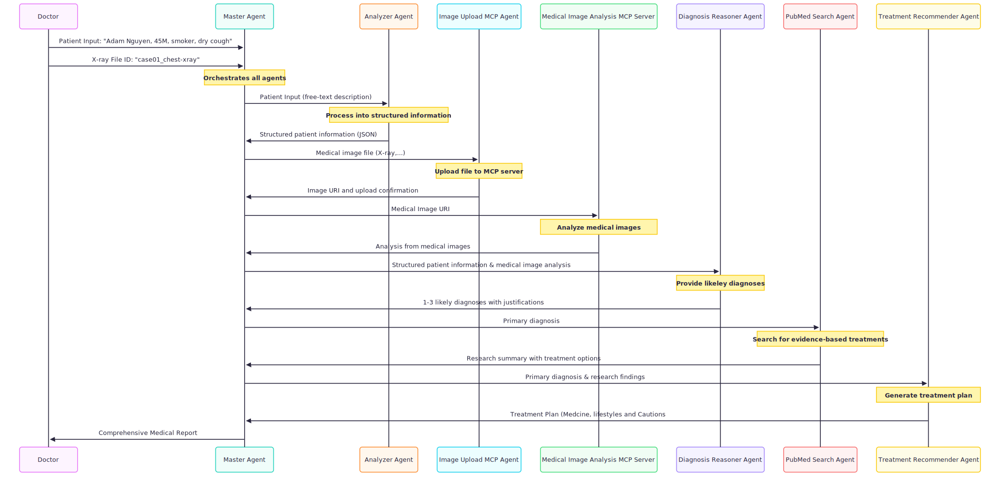
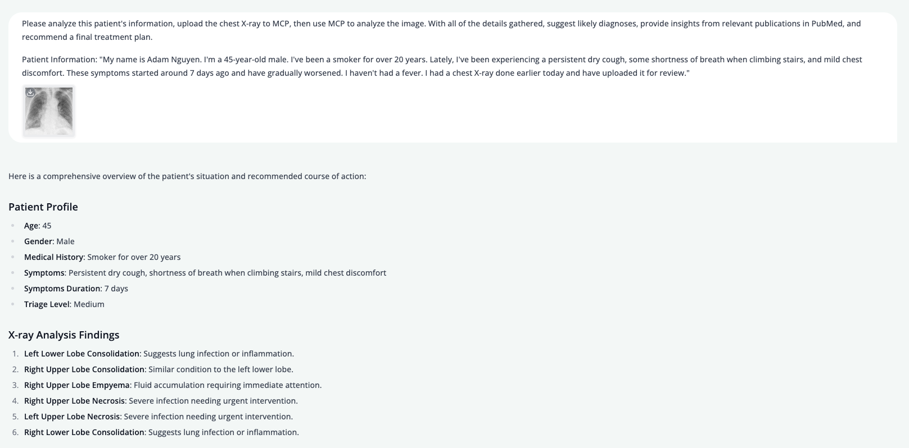
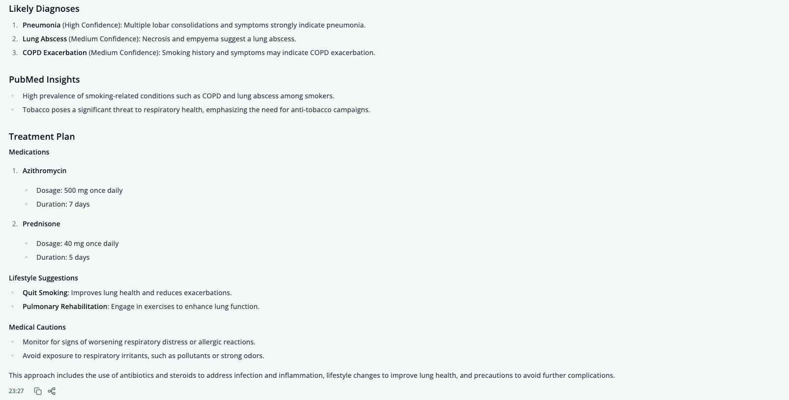
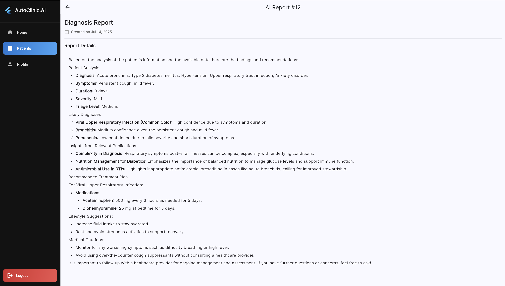

# 🏥 AutoClinicAI System - Team Tiger

A comprehensive medical AI system that processes patient symptoms, analyzes medical images, and provides evidence-based treatment recommendations through a coordinated workflow of specialized agents.

## 🚀 Overview

This system uses a multi-agent architecture to provide comprehensive medical analysis, from initial symptom triage to final treatment recommendations. Each agent specializes in a specific aspect of medical assessment, working together under the coordination of a Master Agent.

## 🤖 Agent Architecture

### Master Agent
- **Role**: Orchestrates the entire medical workflow
- **Function**: Coordinates between specialized agents and manages data flow
- **Technology**: Automatically selects and calls appropriate agents based on context

### Specialized Agents

#### 1. 🔍 Analyzer Agent
- **Purpose**: Extract structured triage information from patient descriptions
- **Input**: Free-text patient symptoms and medical history
- **Output**: Structured JSON with patient's basic information, symptoms, severity, and triage level

#### 2. 📸 Image Upload MCP Agent
- **Purpose**: Process and upload medical images for AI analysis
- **Input**: Medical image file ID (X-rays, CT scans, etc.)
- **Output**: Uploaded image URI ready for analysis

#### 3. 📄 OCR Lab Test Reader
- **Purpose**: Read and analyze blood test result to identify abnormal values
- **Input**: PDF file of the blood test result
- **Output**: Analysis of the blood test result (abnormal values outside of the normal range)

#### 4. 🧠 Diagnosis Reasoner Agent
- **Purpose**: Generate differential diagnoses based on symptoms and lab test analysis result
- **Input**: Structured petient information and lab test analysis result
- **Output**: 1-3 likely diagnoses with medical justifications

#### 5. 📚 PubMed Search Agent
- **Purpose**: Research current medical literature for treatment protocols
- **Input**: Likely diagnosis for patient's problem
- **Output**: Evidence-based treatment research summary

#### 6. 💊 Treatment Recommender Agent
- **Purpose**: Generate comprehensive treatment plans
- **Input**: Diagnosis data and research findings
- **Output**: Complete treatment recommendations

### MCP Server
#### 1. 📸 Medical Image Analysis MCP
- **Purpose**: Analysis the lab medical image of patient (X-rays, CT scans, etc.)
- **Input**: Medical Image
- **Output**: Analysis from the medical images 


## 🔄 Example Workflow Process
### Case 1 workflow (Patient with chest X-ray result)



## 🛠️ Technical Requirements

### Prerequisites
- Python 3.12+
- UV package manager
- OpenAI API access
- PubMed API access
- MCP server setup

## 🚀 Setup Instructions

### 1. 🌐 Google Colab MCP Server Setup

The system requires a Google Colab MCP server for medical image analysis. : [Open MCP Server on Google Colab](https://colab.research.google.com/drive/10SrM5UrB_jHVfnsWO0uoQOTCzoWtaiMM?usp=sharing)

- Once the notebook has finished running, copy the MCP Server Endpoint displayed in the last cell.
- Paste the copied endpoint into the following file:
"agents/get_image_and_upload_mcp/get_image_and_upload_mcp.py"

### 2. 🔧 Environment Configuration
Each agent needs API keys. Update the following files:

**For PubMed Search Agent:**
Create .env file with these fields:
```bash
PUBMED_EMAIL= your-pubmed-email
PUBMED_API_KEY= your-pubmed-api-key
OPENAPI_KEY= your-open-api-key
```

**For other OpenAI-powered agents:**
Create .env file with this field:
```bash
OPENAPI_KEY= your-open-api-key
```


### 3. 🏃 Start AgentOS System

```bash
cd cli
docker-compose up -d

python cli.py signup -u <username> # Register a new user, also available in [UI](http://localhost:3000/)

python cli.py login -u <username> -p <password> # Login to the system, get JWT user token
```

### 4. 🤖 Register All Agents

```bash
# Register all agents with the backend
cd cli
python register_agents.py

# Follow the interactive prompts:
# - Login with your credentials
# - Handle any duplicate agents
# - Confirm registration
```

### 5. 🚀 Start All Agents

```bash
# Start all agents simultaneously
cd cli
python run_all_agents.py

# The script will:
# - Create virtual environments for each agent
# - Install dependencies
# - Start all agents in parallel
```

### 6. 🚀 Open the CLI 
Open Frontend UI: http://localhost:3000/ and start chat with **AutoClinic**!

## 🎯 Example Usage
### 🩺 Case 1: Mr. Adam Nguyen – Respiratory Symptoms with Chest X-ray
📝 **Prompt**:

Please analyze this patient's information, upload the chest X-ray to MCP, then use MCP to analyze the image. With all of the details gathered, suggest likely diagnoses, provide insights from relevant publications in PubMed, and recommend a final treatment plan.

Patient Information:
"My name is Adam Nguyen. I'm a 45-year-old male. I've been a smoker for over 20 years. Lately, I've been experiencing a persistent dry cough, some shortness of breath when climbing stairs, and mild chest discomfort. These symptoms started around 7 days ago and have gradually worsened. I haven't had a fever. I had a chest X-ray done earlier today and have uploaded it for review."

📎 **Uploaded File**:
case1_chest-xray.jpeg

### 💉 Case 2: Ms. Linh Tran – Fatigue & Diabetes-Related Symptoms
📝 **Prompt**:

Please analyze this patient's information, read the blood test to identify anomalies. With all of the details gathered, suggest likely diagnoses, provide insights from relevant publications in PubMed, and recommend a final treatment plan.

Patient Information:
"Hi, I’m Linh Tran. I’m a 32-year-old female. For the past few weeks I’ve been feeling very tired all the time, even after sleeping well. I also get dizzy when I stand up quickly, and my skin feels dry and itchy lately. I’ve been more thirsty than usual and sometimes need to urinate frequently. I recently had a blood test done and I’ve uploaded the report."

📎 **Uploaded File**:
case2_blood_test_report.pdf

## 🎯 Demonstration
### AgentOS Platform



### Flutter Application




## ⚠️ Medical Disclaimer

All medical recommendations should be reviewed by qualified healthcare professionals. This system does not replace professional medical advice, diagnosis, or treatment.